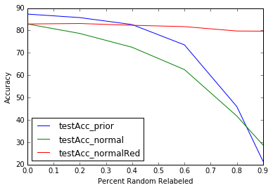

<html>
<head>
<script type="text/javascript" src="http://latex.codecogs.com/latexit.js"></script>
</head>
<body>
# fmnmn
Fixing Mislabled Not MNist (or other mislabeled data) 
The purpose of this code is to introduce a concept that I came up with, and implemented, to correct for mislabeled data. 
Based on the <a href="https://www.kaggle.com/c/ultrasound-nerve-segmentation"> Kaggle competition </a> examining nerve bundles. They mentioned that some of the data, as annotated by humans, could be completely wrong. Looking at the images, you can understand why. This inspired a question:
<p><b> Why do we assume all data is created equally? </b></p>
Humans don't consider data equally, we have high biases. But it seems that the basic ML for logistic regression / NN consider the data equally.
While linear regression etc accounts for the uncertainty in a measurement, the Neural Nets should do so as well.
This is not an idea that hasn't been considered. In fact, there is an increadible amount of literature on it. I haven't even had a chance to begin to scratch the surface. 
But I wanted to play with TensorFlow, improve my pythoning, and more thoroughly explore the idea of poorly labeled data. 
After implementing it, I found it closesly resembles an idea by 
<a href="https://www.google.com/url?sa=t&rct=j&q=&esrc=s&source=web&cd=1&cad=rja&uact=8&ved=0ahUKEwjYrKSXxPbMAhUDM1IKHR77CbEQFggdMAA&url=http%3A%2F%2Fwww.eng.biu.ac.il%2Fgoldbej%2Ffiles%2F2012%2F05%2Ficassp_2016_Alan.pdf&usg=AFQjCNENVQDhdMwYs3O979y5yayJmw9g5A&sig2=Q6xB9CcN297mgPh-CQMq3Q">  by Bekker and  Goldberger </a>. I also found this reference, though it is more difficult to to parse what is going on
[Natarajan](https://www.google.com/url?sa=t&rct=j&q=&esrc=s&source=web&cd=1&cad=rja&uact=8&ved=0ahUKEwjC69f46v_MAhUN5GMKHZwhAIIQFggiMAA&url=http%3A%2F%2Fpapers.nips.cc%2Fpaper%2F5073-learning-with-noisy-labels.pdf&usg=AFQjCNFgDWcK8n9bC9-2GbVVNnnR0Eys9g&sig2=OSSO47kEX5O0zG_odurS1Q)

If you know that has already been considered and explored, please let me know! Given it's simplicity, and wide-spread applicability, I would be impressed if it hadn't been published already. I'm starting to do research... so reading everything is ~~hard~~ impossible.

##The Idea
Basically, all inputs should be associated with prior probabilities as to their quality. What is 'quality'? To remain vague I'd say it is its measure of use in forming a representation. 
For instance, a mislabeled 1 as a 5 can unfortunately distort neuron weights. So, why should it be used in the training? Additionally, an incredibly unique and/or distorted image that has an 'appropriate' label, might not actually prove useful. I mean, of the Mnist entries I cannot identify accurately...

How do we determine the probabilities? We update them just like we update the neuron weights, with back-propigation!

The basic concept occurs at the end of the feed-forward step, the calculation of the cost function J. This is represented
<MATH> J = &sum;<sub>j</sub> J<sub>j</sub></MATH>
where the individual training example j is the cost for that individual example. Well, this is effectively a the mean of the cost, given the batch sizes are the same on each iteration. Why shouldn't we take a weighted mean, where the weights are the priors. <MATH>p<sub>j</sub></MATH> of that example j?
<MATH> J = &sum;<sub>j</sub> p<sub>j</sub>J<sub>j</sub>/&sum; p<sub>j</sub></MATH>

This will more accurately represent the deviation from expected because examples with small priors won't influence the cost. Now, here is the idea: these priors are new 'parameters' that can be learned! So we compute gradients, and can update via backpropigation just like the weights. Lets look at the partial derivitive of J used in this, because it helps me to see what the gradient does. Basically, the partial derivative is:

<MATH>&part; J / &part; p<sub>i</sub> = (J<sub>i</sub> &sum; p<sub>j</sub>- &sum; p<sub>j</sub>J<sub>j</sub>)/(&sum;p<sub>j</sub>)<sup>2</sup>  </MATH>

Well, then this is

<MATH>&part; J / &part; p<sub>i</sub> = (J<sub>i</sub> - J)/&sum; p<sub>j</sub> </MATH>

So, for example i, the prior should change in a manner that is proprotional to the deviation of the cost for example i from the (weighted) average cost J. Because we go the direction opposite of this slope, the prior should <b> increase </b> if
<MATH> J<sub>i</sub> &lt; J <MATH>. In otherwords, if it is a low cost, we should weight example i more. And visa-versa. 

So basically, we can use the consensus of appropriately labeled data to 'weed out' improperly labled data. In a sense, this is similar to recommender systems, except here, the Neural network 'reccmends' that it ignore's an odd example.

There that's it. That is the concept. Pretty easy, hunh? So let's try it out. 

##Results using Logistic Regression

First, lets use simple logistic regression. (I started from a notebook on <a href="https://www.udacity.com/course/deep-learning--ud730">Deep Learning at Udacity</a>.  
(Thisfile)[2_fullyconnected-adversarial.py]

Because TensorFlow handles all of the backprop gradients, we don't have to program in any of that stuff. The relevant code is merely a few more additional lines:

```python
  priors = tf.Variable(tf.ones([train_subset])*0.9,name='priors') #give all inputs 90% prior
  variable_summaries(priors, layer_name + '/priors',1) 
  logits = tf.matmul(tf_train_dataset, weights) + biases
  # Calculate the cross-entropy loss. 
  loss = tf.reduce_mean(tf.mul(
            tf.nn.relu6(priors*6),tf.nn.softmax_cross_entropy_with_logits(logits, tf_train_labels)
```

I pulled a slight hack:  Because the priors can only be in [0,1], I constrained them with the rectified linear function (tf.nn.relu6). For a reason that I don't know, it stops increasing when the input is 6, so I multiply the priors by 6 to have them within [0,1]. Another hopefully obvious step, is once the representation is trained, we do not use the priors anymore. So the extra parameters are not part of future classifications. They were just a tool to get a better set of weights. 

Well how does it do? I tested it in two ways. One, by  randomly mislabling some fraction of the training labels, retraining, and determining test accuracy for the standard logistic regression and for the prior-weighted logistic regression. The plot below shows what it found. 



I tested three combinations of models and data. Green line showed the logistic Regression+prior, Blue was just logistic Regression, and red was the logistic regression examining _only_ the data that hadn't been mislabeled. We can see several things
1. For 0% relabled data, the accuracy increaced from 83% to 87%. That is cool. More on this later.
2. For 60% relabeled data, the accuracy was much improvedxx...

Also, I examined the convergence time. For the models using the priors, 


We can see that the model that used priors converged sooner. This is nice!

### Notes and details
* I ran iterations way beyond normal and found that the accuracy gradually got worse as I continued to train. This is possibly due to data gradually being 'thrown out'. So I just threw in early stopping.
* I used the same initializations for each of the different experiments. 
* I running this a number of time, and the results are quantitatively similar. 
* I didn't optimize learning rates or prior initialization. It is possible that these can impact

##Results using an Artificial Neural Network
The logistic regression is not the best tool for this classification task, as can be seen by the low accuracy. What about a Neural Network. Will that do better? using an architecture with hidden nodes of 500 and 100, both initialized with a random normal distribution with width <MATH>sqrt(6/(n<sub>this</sub> +n<sub>prev</sub>))</MATH>,  common heuristic highlighted by [Glorot and Bengio](http://jmlr.org/proceedings/papers/v9/glorot10a/glorot10a.pdf) (among many other authors). 

xx picture and discussion here xx

##Results using a Convolutional Neural Network
xx


#Considerations and observations
1. One interesting thing to consider, is this will start 'throwing out' examples when the prior becomes 0. That might not be a good thing, especially if we are data limited. So, instead of just classifying data priors as _useful_ or _not useful_, I classified data priors as _'representative of class j_. So now, the probability goes as <MATH>p_<sub>i,j</sub></MATH>. This can be backpropigated in much the similar way. I found similar results as for the previous method 

#Variations
1. Minibatches:  I also performed this using mini batches. For every batch I would initialize their priors to 90% and iterate 10 times. Yes, the mini-batch iteration count is another hyperparameter... but it worked.  For the logistic regression, this technique did just as well as the non mini-batch approach. It also has the effect of not completely throwing out data. The Neuralnet, it seemed that the parameters would too-easily learn the parameters to classify the subset, and the representation wouldn't transfer to the other subsets. It is possible that keeping a record of the priors so if the next subset of data was reconsidered, labels would be re-initialized, and then the algorithm wouldn't iterate too many times over the minibatch. 
Obviously, this technique wouldn't make as sense in online learning (minibatch of one example)
2. Sigmoid instead of relu6: I tried some variations on how to express the priors. I took a sigmoid of the priors, and found that convergence took forever. I tried 
3. Randomly Re-initialize priors? Because early training might inaccurately cause data to be 'dropped out', it might be beneficial to 'drop them in' by adding a probability that they actually weren't bad at all. 


#DISCUSSION
##Related to Dropout?
It seems that this might be a contributing factor to 'dropout' techniques that are used to prevent neurons from 'over representing' a given examples. 

##Similarity to recommender systems. xx

##

</html>
